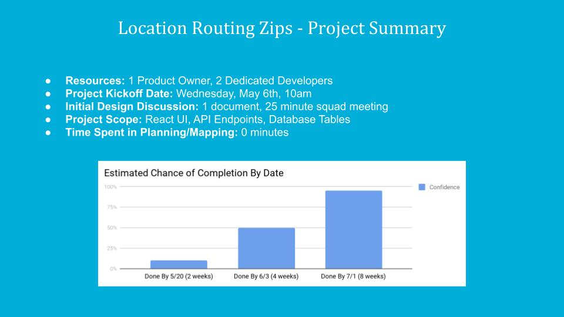
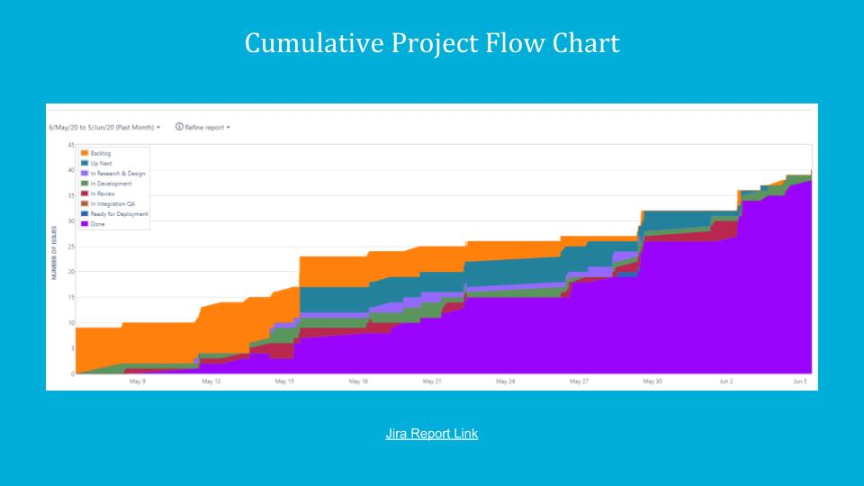
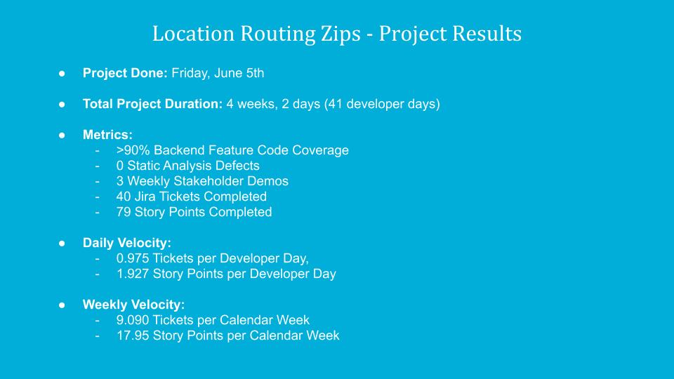

# Incremental Kanban - Project Case Study #1

There are many flavors and approaches to Agile Software development. Sometimes it's easy to get lost in all the variations, and all the terminology.

For me personally, I believe that truly agile software development is about having a whole team working closely with each other to solve customer problems in a simple and sustainable way.

If you read my recent blog post, you will know that I believe the #1 problem to solve is [work flow](https://sites.google.com/carvana.com/blog/engineering-blog/software-development-and-the-principle-of-flow?authuser=0). If you have excellent throughput, then your team has the agility they need to solve virtually every other problem related to software development.

----

## What does this look like in practice?

Two weeks ago, I finished a MarketOps software project that utilized the **Incremental Kanban** work process.

## What is Incremental Kanban?

**Incremental** means that we solve a project piece by piece as we discover the needed work. It's the opposite of a Comprehensive Approach. In an incremental approach, we create Jira tickets as we discover they are needed while working on the project. We never spend time or effort trying to anticipate everything that will be needed beforehand.

**Kanban** is an approach to work that is throughput-centric. There are no Sprints or iterations (which are part of SCRUM). Instead, there is a single board that is used to visualize all work. Every team member may have 1 work item in progress at a time. The goal is to move the tickets from Up Next to Done as efficiently as possible. You can measure your flow/velocity by the number of tickets and Story Points that move across the board each day or week.

----

## Case Study: Location Routing Zips Project

Most arguments for and against various workflow principles and practices are anecdotal and rooted in emotions and vague thoughts. I think there is a value in being methodical and scientific, and in measuring quantifiable results.

After completing the Location Routing Zips project, I spent a couple of hours pouring over the metrics and graphs in Jira to quantify the numeric details of the project.

Here is the slide deck summary of the project:

Based on these results, I would say it seems that **Incremental Kanban** used in conjunction with **Confidence-Interval Estimates** provides a fantastic balance of rapid project delivery (which developers love) and predictable project timelines (which product owners and project managers love).

As someone with a love for speed and predictability, this way of working helps me and my team to enjoy low-encumbrance processes, while still giving predictability and date targets that help with strategic business planning.

----

## An Ongoing Discussion

I would be interesting in learning more about other Carvana software project metrics and software development practices.

Does your team have another set of key workflow practices?

What throughtput are you seeing on your projects?

How accurate are your team's project estimates?

If we converse about these things and share techniques and tricks, I know that we can improve every team's workflow mental toolboxes, which will make us all happier, more peaceful, and more productive (with less effort).
