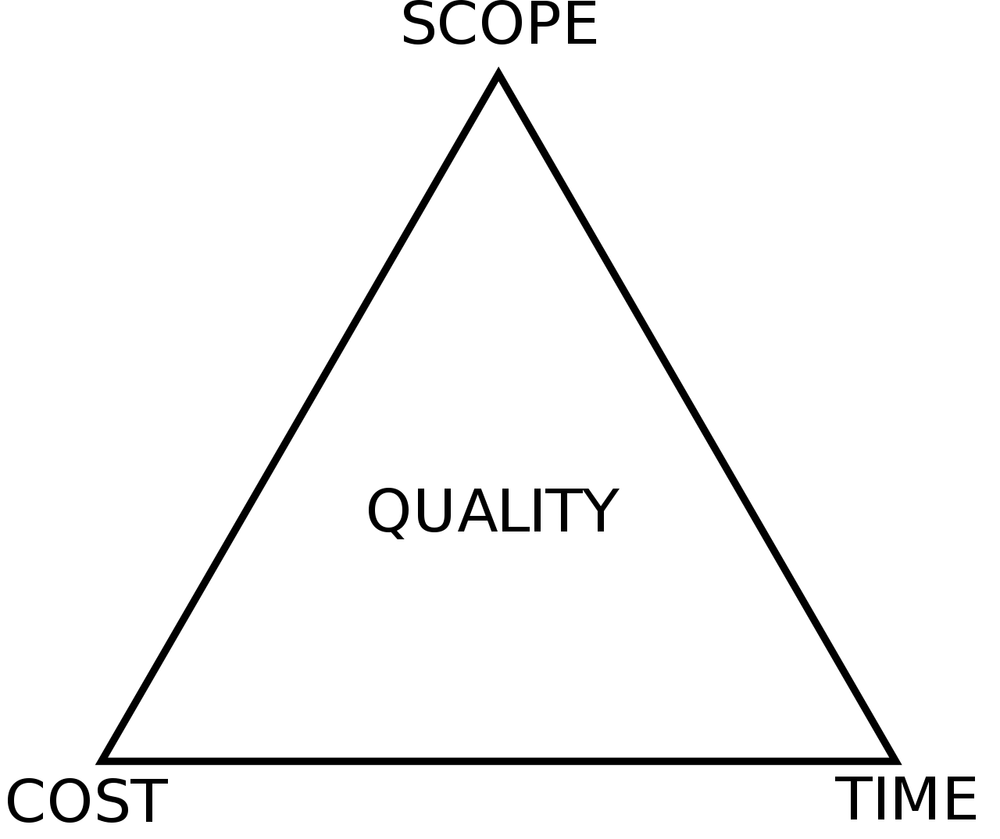
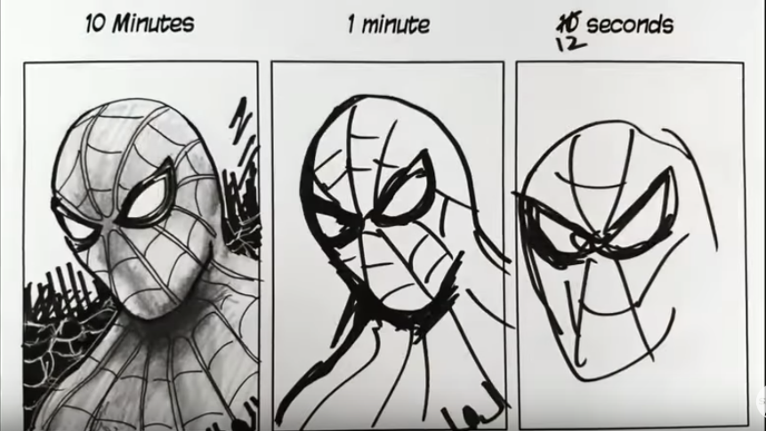

# Chapter 2 - Constraints and the Iron Triangle

What's the most significant risk that you face as a project manager?

**The most significant risk you face is the project failing due to not staying within its constraints.**

The worst thing that can happen is for a project to get canceled before it's finished.

This can easily happen if things take too long, if the core of the project isn't right, or if the costs have gotten out of control.

How can you, as a project manager, help foresee and avoid these enormous risks?

**The best way to avoid project failure is by correctly conceptualizing your constraints using the Iron Triangle.**

---

## What is the Iron Triangle?

Three inputs determine the final output.

1. Scope
2. Cost
3. Time

Any of these three can vary.

The most you can ever hold constant, in real life, is two out of three.

In a research project, it could be that none of the three is locked in. The scope might not be known. The maximum budget might be open-ended. The time the research is allowed to take might be flexible.

However, in most projects that you will manage, at least two of these will be constrained.

It is often the case that the project stakeholders wish to have all three fully constrained. Experience will teach you that for any non-trivial project, this is impossible.

----

## Determine the Variable Constraint

Consider an example project of building a stock trading tax calculation software. It may be that Gary, the CEO, wants the project finished within one year, on a budget of $200K.

**Your job as a project manager is to determine which constraint must be the flexible one.**

If the *budget* is unchangeable and the *timeline* is fixed, then what is unknown is the precise **scope** of what will be delivered.

If the *scope* of the project is the most important and the *budget* is unchangeable, then what is unknown is precisely **how long** the project will take.

If the *scope* of the project is fixed and there is a hard *deadline*, then the project's **cost** is unknown.

The law of constraints GUARANTEES that one of the three corners will be unknown until the project is complete. It's a law of the universe, and no amount of wishful thinking or optimistic promises will change that fact.

Many clients, even experienced ones, won't wish to accept a fully uncertain third variable.

----

## Levels of Project Management Mastery

How well you handle the Iron Triangle is one of the most important things determining your effectiveness as a project manager.

- A **POOR** project manager will promise to keep all three inputs constrained and then be forced to make excuses near the end of the project, when the budget, timeline, or scope has slipped.

- A **GOOD** project manager promises to keep the clients updated and apprised of budget, timeline, or scope changes the moment they are discovered.

- A **GREAT** project manager determines which two are most important to the client. They give the clients a range-based estimate for the variable dimension and keep the client updated on the variations as the estimate is refined over the course of the project.

- A **FANTASTIC** project manager teaches his clients about the Iron Triangle, and teaches them to inherently accept and monitor the uncertainty of the third dimension.

----

## How This Looks In Practice

**Gary:** "We're looking to create a software tool that allows users to provide their stock tradesto calculate their tax liability for a specific tax year. You'll be managing this project."

**You:** "That sounds fantastic. How fast would you be hoping to have this project rolled out to our users?"

**Gary:** "With the new tax laws, if we could be first to market incorporating the changes, we would have a huge advantage over our competitors. That gives us 9 months to finish this."

**You:** "Makes sense. What are your thoughts on how many members we could assign to this project?"

**Gary:** "This will be our company's number two priority for this year. As long as you don't take anyone off of Project Ocelot, it can be as many as the project needs."

**You:** "Great. How flexible are the project requirements? What are the absolute essentials that we have to have in the first public rollout?"

**Gary:** "All the tax laws need to be accounted for. Users need to be able to connect their stock trading accounts from at least the biggest 20 online brokerages. All the calculations must be correct."

By explicitly putting out feelers towards each of the three dimensions, you have learned that the minimum Scope is fixed and the Timeline is critical. This means that mentally, you know the only dimension you want to be flexible is Resourcing. In many real-world projects, the cost isn't represented with simple currency amounts. It's often represented by manpower, materials, outsourcing, required tools, and so forth.

----

## Final Project Output

You may have noticed that in the center of the Iron Triangle is the word Quality. This represents the final project output.

The more time, resources, and scope you have, the higher a project's quality can be. With less time, smaller scope, and smaller resources, the smaller and less refined the project will be.

This isn't necessarily the same as project success. You can have a very small project that is wildly successful. **The key thing to avoid is having a lopsided distribution.**

You may have seen this vivid illustration of the same artist drawing a picture of Spiderman using different time constraints.

This is an example of possible outcomes with fixed resources and a fixed scope, varying the project timeline.

Allocating more time may result in dramatically better project quality.

There is a tight balance between the three dimensions, and if you end up with a lopsided variation, the project's final quality will be lower. With well-balanced dimensions, the project's final quality will be what you are aiming for.

A successful project manager aims for high project quality, which is much, *much* more important than a large scope.

----

### The Iron Triangle is Your Friend

As you deliver a project, using the Iron Triangle will help you deliver a quality product and reduce the amount of uncertainty inherent in a project.

Suppose you have a project that isn't naturally constrained, such as a research project or a solo project. In that case, you will find that setting constraints will increase your effectiveness at delivering a successful project.

At the beginning of every project, you should know which constraint is necessarily variable and monitor that one closely. If you monitor it closely, then you and the team won't be surprised when the inevitable changes occur.

As you gain more experience, you will learn and develop distinct strategies for managing each of the three dimensions that vary. I will cover techniques for each of those later.

If anyone ever asks you to commit to a project that is constrained in all dimensions, never commit. You absolutely must teach them that it's impossible to constrain all three dimensions since there are always project unknowns.

Once you have fully internalized the Iron Triangle, you are well on your way to delivering highly leveraged value, which increases your personal value and your ability to undertake larger, more complex, and more meaningful projects.

----

## Chapter Review Questions:
1. What are the three input dimensions in the Iron Triangle?
2. How many dimensions can be predictably constrained?
3. How many dimensions do most clients want to be constrained?
