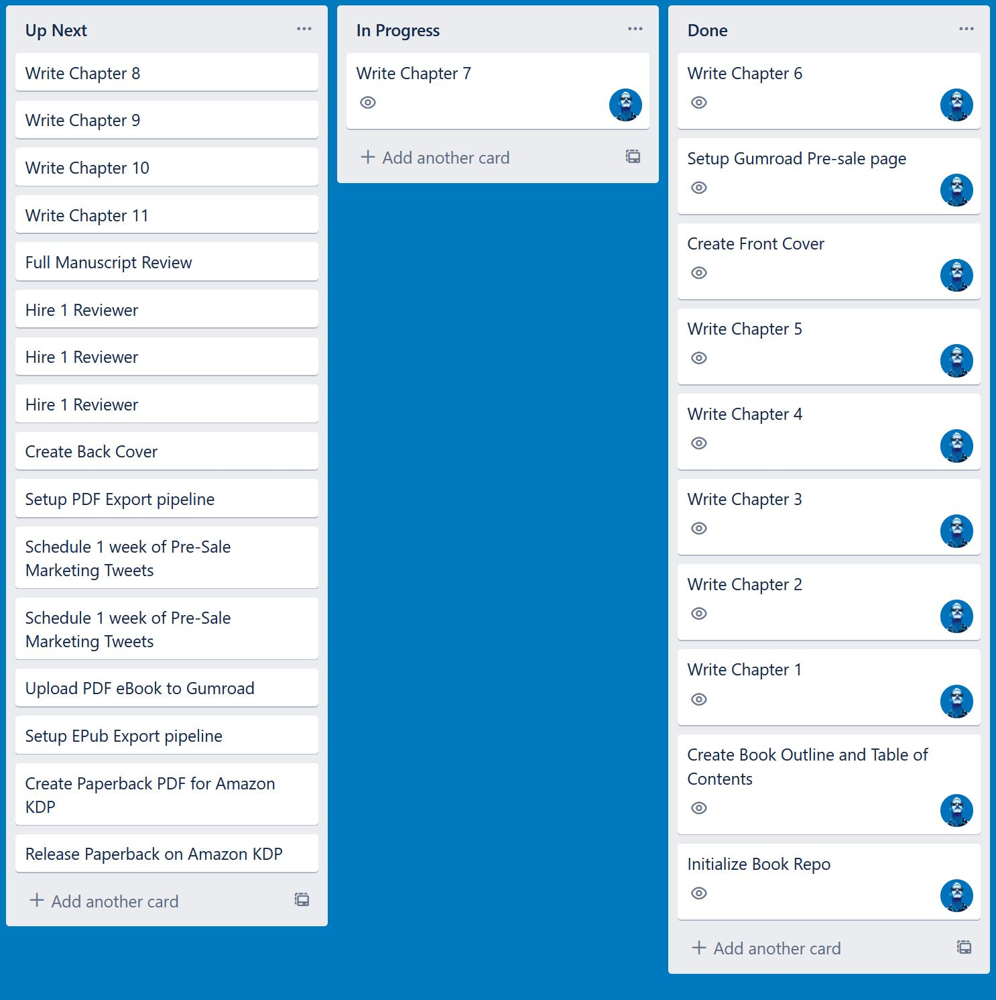

# Chapter 7 - Kanban: The Good and Bad

Kanban is a system that predates Agile but has since been adopted as one of the most prominent methodological frameworks for implementing Agile at a company. There is a bit of overlap between the two, but also some differences.

I don't want to get into the academic details. Instead, I just want to introduce you to the practical concepts that will be the most useful to you on a daily basis.

What are the fundamental concepts of the Kanban methodology?

1. Visual representations of the workflow
2. Optimized for speed of delivery
3. Makes it easy to identify waste and bottlenecks
4. Very high flexibility
5. Minimal planning and preparation overhead

This is my very favorite of all the Agile frameworks because it empowers us to manage projects without a ton of ceremony and allows us to quickly adapt to new ideas and changing scenarios without expensive rippling effects.

Whenever I manage a project, using a pure Kanban flow is my go-to. It's the fastest to set up. It's easy to teach to people and it puts the focus on delivering the project, which is what project management is all about.

The Kanban methodology is about managing the process workflow by visualizing tasks and ensuring that tasks are fully completed from start to finish. The whole team focuses on observing and improving that task flow.

---

## Good Result - One Glance Visualization

The primary tool required to do Kanban is a Kanban board. It consists of vertical columns of tasks, consisting of, at a minimum, columns for Up Next, In Progress, and Done.

Here is a look at my Kanban board for this book-writing project.

At a glance, I can see what progress has been made, what is currently being worked on, who has been delivering the project's work, and roughly how much work remains.

This is a powerful visual metaphor! When done correctly, it enables anyone to see the state of a project at that moment in time and instantly grok it.

People are visual creatures, and I have never found any simpler or clearer way to present a project snapshot that yields as much information with as few elements. This is one of the fantastic things about Kanban.

If you are managing a project, even if you aren't using Kanban, you must ensure that you have some view that enables you to see the entire state of the project in a single glance. If one doesn't already exist, you should create one. The effort-to-value ratio is insane!

---

## Good Result - Optimized for Speed of Delivery

The project is healthy if tasks are regularly flowing from left to right. The example board is a single-person project, but on more evolved boards, you can also see which team members deliver the most tasks.

Every time you look at the board in a healthy project, something should be different from the last time you looked at it.

In the Kanban system, there is the concept of a WIP limit. The rule is that only a certain number of tasks may be in any workflow step at a time. If a task gets stuck and hasn't moved for some time, the team must come together and work together to get the task unstuck and address any systemic issues that caused the work to stop.

While delivering a project, the team gets a good feeling every time a task makes it to the Done column. The team will feel troubled and step in to solve things if tasks aren't flowing through to completion.

This way of working is fantastic for people and teams who value their time! This is a huge perk. Optimizing for efficiency saves a ton of money and helps projects to be economical about how much time is spent on a project.

---

## Bad Result - Underemphasis on Planning

One of the potential dangers of the Kanban framework is that, given how fast it is to set up and how good it feels to deliver tasks, it's very easy to skip completely over a project planning phase.

This is because Kanban was developed in a manufacturing environment, where the workflow steps were already predefined and mostly non-negotiable. In contrast, in most projects that you lead, there are many unknowns.

All well-managed projects do some planning and discovery upfront. How much planning is the right amount varies with the type of project, the team's skill, the comfort level of the team, the desired budget, and the desired timeframe. However, you should always have a planning phase before kicking a project into full gear.

**Failing to plan is the same as planning to fail.**

Never skip planning!

---

## Good Result - Very High Flexibility

Another great feature of Kanban is just how incredibly flexible it is. It's not nearly as prescriptive as other Agile frameworks. It involves far less overhead and planning.

**Suppose you want to have fixed costs and scope, while time is the flexible element?** Perfect. Each week, just report on how many tasks are in Done compared with in Up Next.

**What if you have a fixed scope and timeline?** You can bring in new team members or allocate more focus on this project to the senior team members. It's easy to see precisely how much work is left before the project is finished, so you can see if you need to allocate more money/team members or if you can ease off.

**What if the timeline and costs are fixed?** You can reorder the tasks based on their importance, remove the least important tasks, or add more tasks if you are ahead of schedule. Every day you can come in and tweak the Up Next column without impacting any other part of the project process.

Does your project have a different set of process steps? That's great. Make whatever columns you need on your board. You don't have to hire a contractor to build you custom software plugins.

Kanban is extremely lightweight, which is what makes it very flexible.

Being rigid and hard to change is one of the best ways to jeopardize a project's success. A pure Kanban workflow makes it nearly impossible to make things too rigid.

---

## Kanban Takeaways

Honestly, I love Kanban so much that I could probably write a whole book about all the hidden benefits that I have discovered from using Kanban in my project management toolkit.

Whether you use Kanban or not, these are the things that you want to be part of your project management approach:

1. Visualize the entire project at a glance
2. Make it easy and addicting to deliver tasks rapidly
3. Enable high flexibility to handle changes and mid-project discoveries

If you have a process with these three features, you're going to be in a very good place, regardless of whether you use Kanban.

That said, what's my recommendation? Use Kanban unless you run into problems that it can't solve. Kanban has been around for 80 years and has stood the test of time. It's been around even longer than Agile. It incorporates **A LOT** of human wisdom around workflow management. By using it, you will learn more and more about which problems it has effectively solved.

---

## Chapter Review Questions
1. What is the key tool necessary for doing Kanban?
2. What is the key goal of Kanban?
3. In the Kanban flow, what should happen if a work task gets stuck?
4. What elements can you customize to make the Kanban flow work for your project?
